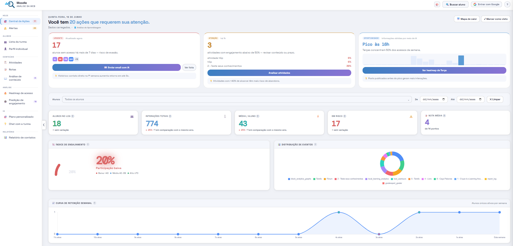
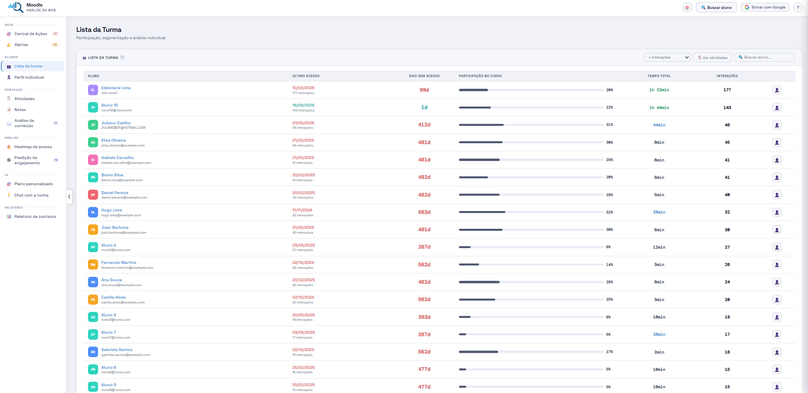
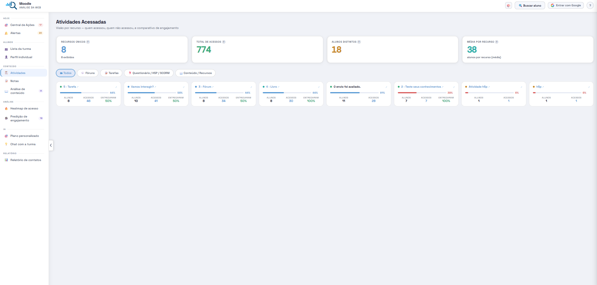
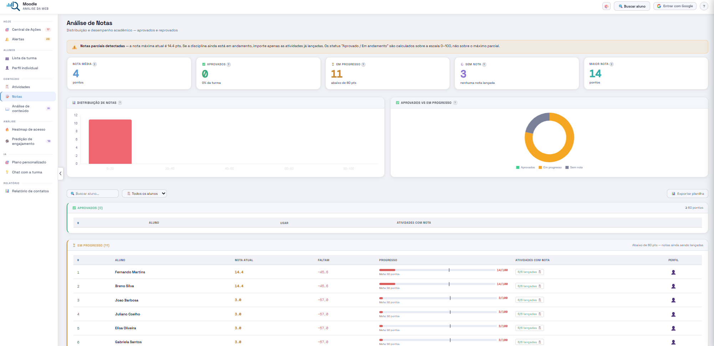
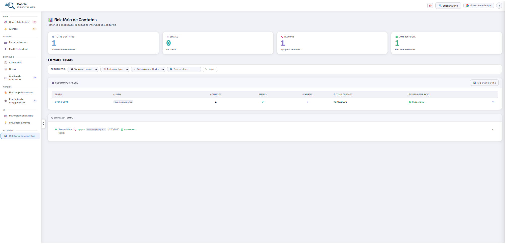

# MWA Analytics Dashboard

A Moodle block plugin that provides real-time learning analytics, engagement prediction, and AI-powered pedagogical intervention tools for instructors.

## Screenshots

### Action Center — Urgent alerts and daily priorities

### Class List — Participation, time on course and last access

### Activities — Per-resource breakdown with submission tracking

### Grades — Progress tracking with per-activity detail

### Contact Report — Intervention history and CRM

---

## Features

- **Action Center** — Urgent alerts: students at risk of dropout, missing submissions, sudden engagement drops
- **Engagement Index** — Multi-dimensional score combining grades (50%), activity coverage (30%), and task delivery (20%)
- **Evasion Prediction** — AI-powered analysis identifying students at risk based on access patterns
- **Student Profiles** — Individual CRM with contact history, private notes, and engagement timeline
- **Activity Analysis** — Per-resource breakdown showing who accessed, who submitted, who didn't
- **Time-on-Resource** — Session-based time estimation per student per activity
- **Heatmap** — Access patterns by day/hour with student names on hover
- **AI Recommendations** — GPT-powered suggestions for course design and individual student intervention
- **Email Integration** — Send personalized emails via Gmail API with auto-logging to contact history
- **Contact Report** — Full CRM with filters, timeline and XLSX export
- **Export** — XLSX export for grades, contact reports and student lists

## Requirements

- Moodle 4.1 or later
- PHP 7.4 or later
- Standard log store enabled (`logstore_standard`)

## Installation

1. Download the plugin ZIP file
2. Go to **Site Administration → Plugins → Install plugins**
3. Upload the ZIP file and follow the prompts
4. Add the **MWA Analytics Dashboard** block to any course page

Alternatively, extract the ZIP into `/blocks/mwa_dashboard/` and visit the admin notifications page.

## Usage

1. Navigate to a course where you have teacher/manager role
2. Click **Open Dashboard** in the MWA block
3. The plugin automatically fetches logs and grades from Moodle
4. Optionally connect Gmail for AI-assisted email sending

## Privacy

This plugin reads existing Moodle log and grade data for analysis purposes. It does not store any personal data in its own database tables. See `classes/privacy/provider.php` for the GDPR/LGPD compliance implementation.

## Third-party libraries

- [Chart.js](https://www.chartjs.org/) v4.4.7 — MIT License
- [SheetJS](https://sheetjs.com/) v0.20.3 — Apache-2.0 License

## License

GNU General Public License v3 or later — see [LICENSE](LICENSE) for details.

## Documentation

📖 [Full User Manual]([https://brunno321.github.io/moodle-block_mwa_dashboard/]) — step-by-step guide covering all features, installation and configuration.

## Author

Bruno Porto — 2026
Educimat/IFES - 2026
